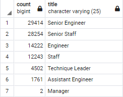
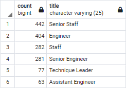

# Pewlett Hackard Analysis

## Overview:
Bobby from Pewlett-Hackard would like for us to setup a database where we can import and house employee and department data. Furthermore, Bobby would like for us to calculate the number of employees by title that can be anticipated to be retiring soon. Bobby is considering starting up a mentorship program where employees that are going to retire soon can move to a part time position and mentor newer employees for their future with the company.

## Results:
 - We created a table (retirement_titles) with a list of employees born bwtween 1952-01-01 and 1955-12-31 to determine employees that would be eligible for retirement. CSV available here: [retirement_titles.csv](Data/retirement_titles.csv)  
 - From the retirement_titles table we created the unique_titles table that only contains each potential-retiree's most recent title. CSV available here: [unique_titles.csv](Data/unique_titles.csv)  
 - We then created the retiring_titles table where we counted how many potential-retirees there may be per job title.  
     
 - We then created a table (mentorship_eligibility) that lists employees that will be eligible for Bobby's upcoming mentorship program. CSV available here: [mentorship_eligibility.csv](Data/mentorship_eligibility.csv)  
 - I decided to go one step further to make Bobby's job a little easier, and I made a table (mentorship_eligibility_count) to count the number of potential mentors by job title.  
     

## Summary:
With 90,398 out of 240,124 current employees (37.6%!) approaching retirement, Bobby will need to get some measures in place to fill the newly available positions and train the new employees! Luckily, he has an idea to create a mentorship program to help transition retirees, as well as up-coming all-stars into their new positions.

### Side Note:
While looking through the data, I did notice a dicrepency that could potentially skew some numbers. When I queried `dept_emp` with the `'Manager'` title and `to_date = '9999-01-01'` I got a list with 24 names on it, including several instances of multiple entries for a single department. When I ran the same query on the `dept_manager` table, I get a list of 9 `'Manager'`s with only one per department. Upon further inspection, the `'Manager'`s in the `dept_emp` table ALL have `"to_date = '1999-01-01'"`; which is incorrect, according to the `dept_manager` table. I would guess that once the `dept_manager` table was created, the `dept_emp` table was no longer updated with changes to reflect a new `to_date`, which inflated the number of `'Manager'` titles when querying the `dept_emp` table for managers. This should be updated.
